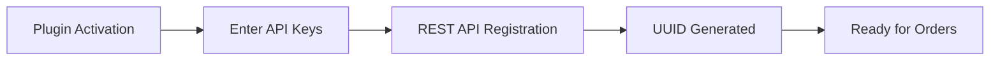
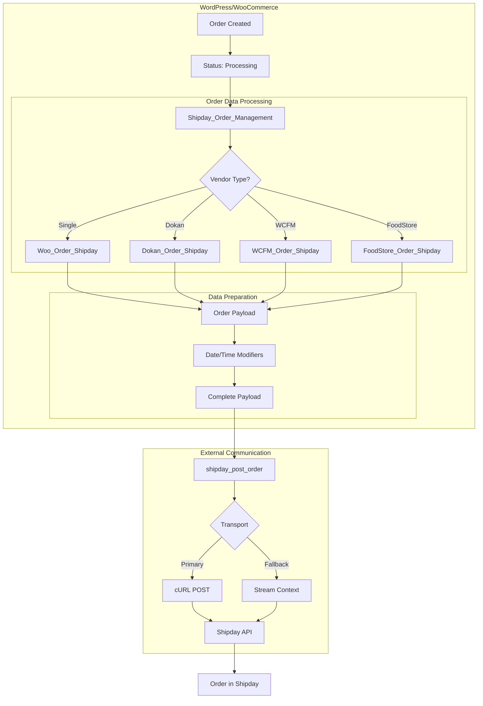
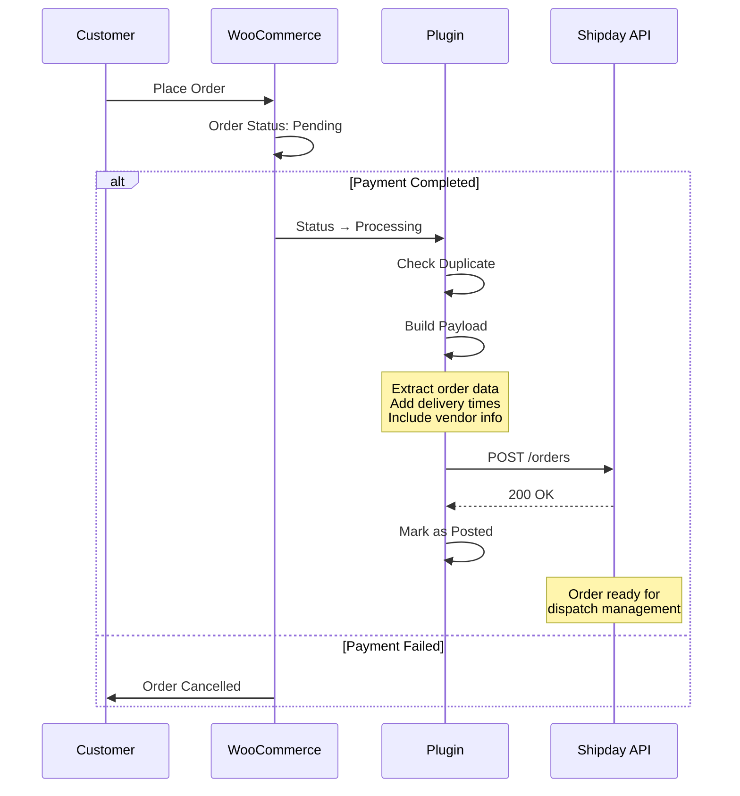
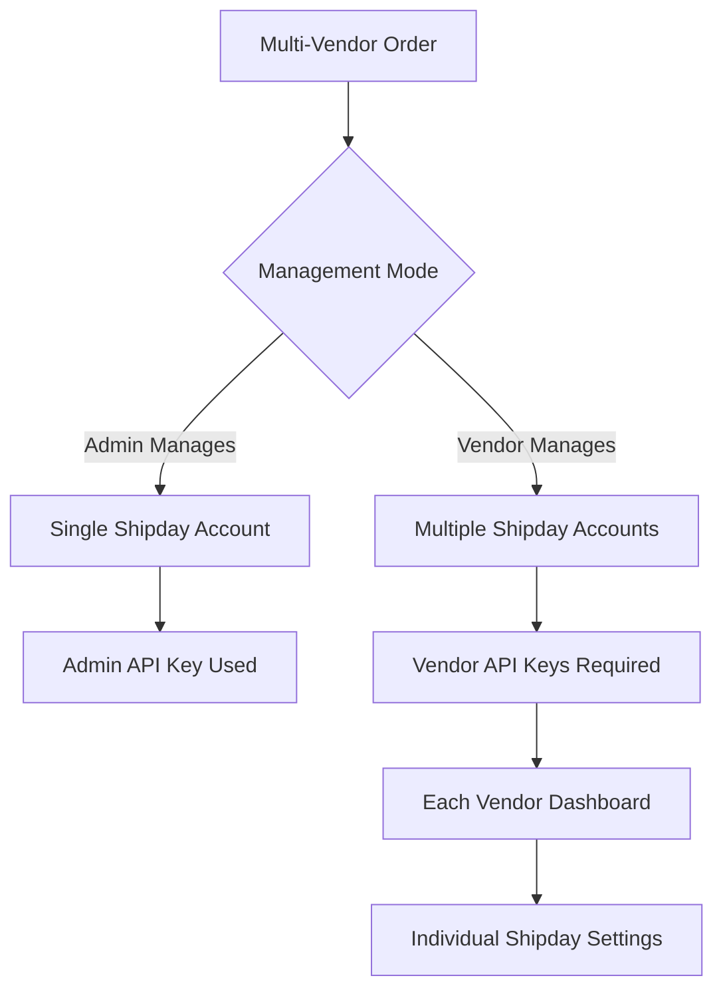

# WooCommerce Shipday Plugin Documentation

## Table of Contents
1. [Overview](#overview)
2. [Setup & Connectivity](#setup--connectivity)
3. [High-Level Architecture](#high-level-architecture)
4. [Order Lifecycle Guide](#order-lifecycle-guide)
5. [Multi-Vendor Support](#multi-vendor-support)
6. [Date & Time Integration](#date--time-integration)
7. [API Reference](#api-reference)

## Overview

The WooCommerce Shipday Plugin enables seamless integration between WooCommerce stores and Shipday's delivery management platform. It automatically sends order data to Shipday when orders reach processing status, supporting both single-vendor and multi-vendor setups.

**Key Features:**
- Automatic order dispatch to Shipday
- Multi-vendor marketplace support (Dokan, WCFM)
- Delivery date/time scheduling integration
- Previous order synchronization
- REST API webhook support

## Setup & Connectivity

### Prerequisites
- WordPress with WooCommerce installed
- Active Shipday account with API key
- WooCommerce REST API credentials

### Installation Steps

1. **Install Plugin**
   - Upload plugin to `/wp-content/plugins/`
   - Activate through WordPress admin

2. **Configure Shipday Settings**
   Navigate to: `WooCommerce → Settings → Shipday`

   **Required Settings:**
   - **Shipday API Key**: Get from Shipday Dashboard → My Account → Profile → API Key
   - **Consumer Key & Secret**: Generate in WooCommerce → Settings → Advanced → REST API
     - Set permissions to `Read/Write`
     - Copy credentials immediately (shown only once)

3. **Optional Settings**
   - **Sync Previous Orders**: Enable to send existing processing orders to Shipday

### Configuration Verification



## High-Level Architecture



### Core Components

1. **Entry Point** (`shipday-integration-for-wooCommerce.php`)
   - Initializes all components
   - Checks WooCommerce dependency

2. **Settings Management** (`WC_Settings_Tab_Shipday.php`)
   - Handles plugin configuration
   - Manages vendor-specific settings

3. **Order Processing** (`Shipday_Order_Management.php`)
   - Hooks into order status changes
   - Prevents duplicate submissions
   - Manages order dispatch

4. **Data Models** (`order_data/`)
   - Transforms WooCommerce orders to Shipday format
   - Handles vendor-specific data

5. **API Communication** (`dispatch_post/post_fun.php`)
   - Sends orders to Shipday API
   - Implements retry mechanism

## Order Lifecycle Guide



### Detailed Order Flow

1. **Order Trigger**
   - Hook: `woocommerce_order_status_processing`
   - File: `Shipday_Order_Management.php:15`

2. **Duplicate Prevention**
   - Uses WordPress transients (30-day persistence)
   - Key: `shipday_order_posted{order_id}`

3. **Order Filtering**
   - Skips pickup orders (`local_pickup` shipping method)
   - Checks `_shipday_order_sync_prevent` meta

4. **Payload Construction**
   ```
   Order Data Structure:
   ├── Order IDs (orderNumber, additionalId)
   ├── Customer Info
   │   ├── Name, Email, Phone
   │   └── Shipping/Billing Address
   ├── Restaurant Info
   │   ├── Store Name
   │   └── Store Address
   ├── Order Items
   │   └── Name, Quantity, Unit Price
   ├── Costing
   │   ├── Subtotal, Tax, Tips
   │   ├── Discount, Delivery Fee
   │   └── Total
   ├── Delivery Instructions
   ├── Payment Method
   └── Metadata
       ├── Plugin Version
       ├── WooCommerce Version
       └── Timezone Info
   ```

5. **API Communication**
   - Endpoint: `https://api.shipday.com/orders`
   - Auth: Basic Auth with API Key
   - Retry: Falls back to stream context on cURL failure

## Multi-Vendor Support

### Supported Platforms
- **Dokan** (Lite/Pro)
- **WCFM** (WC Marketplace)
- **FoodStore**

### Vendor Management Options



### Configuration by Platform

**Dokan Settings:**
- Location: `WooCommerce → Settings → Shipday`
- Options:
  - Admin manages all deliveries
  - Vendors manage own deliveries

**WCFM Settings:**
- Similar structure to Dokan
- Vendor settings in WCFM dashboard

## Date & Time Integration

### Supported Plugins
1. CodeRockz Woo Delivery (Free/Pro)
2. Tyche Order Delivery Date (Free/Pro)
3. WooCommerce Delivery Area Pro

### Data Flow
```
Order → Date Plugin → Date Modifier → Shipday Payload
                         ↓
                   Extract Times:
                   - expectedDeliveryDate
                   - expectedDeliveryTime
                   - expectedPickupTime
```

## API Reference

### Endpoints

**Shipday Order API**
- URL: `https://api.shipday.com/orders`
- Method: POST
- Auth: Basic Auth (API Key)

**REST API Registration**
- URL: `https://api.shipday.com/woocommerce/install`
- Purpose: Register WooCommerce REST API for webhooks

### Hooks & Filters

**Actions:**
- `woocommerce_order_status_processing` - Triggers order dispatch
- `shipday_settings_updated` - Triggers REST API registration

**Filters:**
- `shipday_order_data_filter` - Modify order payload before sending
- `wc_settings_tab_shipday_settings` - Customize settings fields

### Error Handling

1. **API Failures**
   - Logged to `functions/logger.php`
   - Transient cleared for retry

2. **Validation**
   - REST API credentials verified
   - Order data sanitized
   - Emoji removal for compatibility

### Security Considerations

1. **API Key Storage**
   - Stored in WordPress options table
   - Never exposed in frontend

2. **REST API Security**
   - Requires Read/Write permissions
   - Consumer secret validation

3. **Data Sanitization**
   - User inputs sanitized
   - SQL prepared statements used
